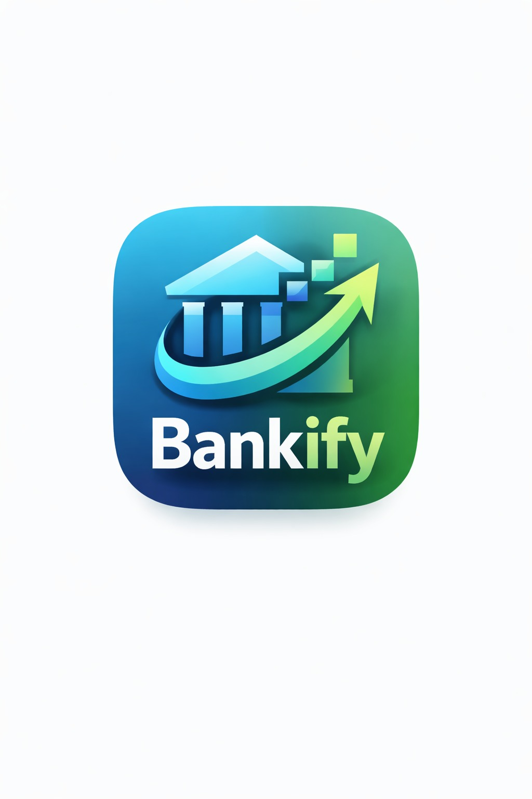
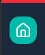

# 📘 Manual de Identidad
## Bankify

> **"Tecnología y confianza para tu gestión bancaria."**

---

# 1. Ícono

---

# 1.1 Logo

---

# 2. Paleta de Colores

## 🔵 Azul profundo

El azul oscuro es la base principal de la marca.  
Representa:

- Confianza
- Seguridad
- Estabilidad
- Profesionalismo

Es el color que conecta directamente con el sector bancario tradicional, generando credibilidad y respaldo.

---

## 🔷 Azul brillante

El azul más vibrante aporta modernidad y tecnología.  
Representa:

- Innovación
- Transformación digital
- Dinamismo
- Interacción

Este tono se utiliza en elementos activos como botones y componentes interactivos.

---

## 🟢 Verde crecimiento

El verde simboliza:

- Crecimiento financiero
- Progreso
- Resultados positivos
- Rentabilidad

La flecha ascendente del logo refuerza este concepto visualmente, transmitiendo avance y éxito económico.

---

## 🟢 Verde claro (acento)

Se utiliza como color complementario para:

- Indicadores positivos
- Confirmaciones
- Estados exitosos

Aporta frescura y energía a la identidad.

---

## ⚪ Blanco y tonos neutros

El blanco y los grises suaves equilibran la identidad y permiten:

- Claridad visual
- Espacios limpios
- Jerarquía en la información
- Mejor legibilidad

---

# 3. Tipografía

- Sans-serif

---

# 4. Imágenes Utilizadas

Para este caso utilizamos las imágenes siguientes:

---

# 5. Imágenes de diseño:

